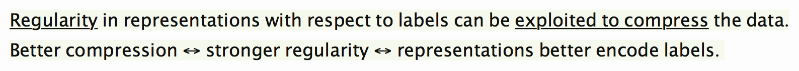

# Information-Theoretic Probing with Minimum Description Length

This is the official repo for the paper [Information-Theoretic Probing with Minimum Description Length]().

Read the official [blog post](https://lena-voita.github.io/posts/mdl_probes.html) for the details!

## What is this about?

To measure how well  pretrained representations  (BERT, ELMO) encode some linguistic property, it is common to use accuracy of a probe, i.e. a classifier  trained to predict the  property from the representations.
However, such probes often fail to adequately reflect differences in representations, and can show different results depending on a setting. 

We look at this task from the __information-theoretic perspective__. 
Our idea can be summarized in two sentences. 

Formally, as an alternative to the standard probes,

* we propose information-theoretic probing which measures minimum description length (MDL) of labels given representations;

* we show that MDL characterizes both probe quality and the amount of effort needed to achieve it;

* we explain how to easily measure MDL on top of standard probe-training pipelines;

* we show that results of MDL probes are more informative and stable than those of standard probes.

__Interested?__ More details in the [blog post](https://lena-voita.github.io/posts/mdl_probes.html) or the paper.

This repo provides code to reproduce our experiments.

## Description Length and Control Tasks

[The control tasks paper](https://www.aclweb.org/anthology/D19-1275.pdf) argued that standard probe accuracy can be similar when probing for genuine linguistic labels and probing for random synthetic tasks (control tasks). To see reasonable differences in accuracy, the authors had to constrain the probe model size. 

In our experiments, we show that MDL results are more informative, stable and do not require manual search for settings.

[GO TO THE EXPERIMENTS](./control_tasks)

## Description Length and Random Models

Several papers argued that accuracy of a probe does not sufficiently favour pretrained representations over randomly initialized ones. In this part, we conduct experiments with pretrained and randomly initialized ELMO for 7 tasks from the [edge probing paper](https://arxiv.org/abs/1905.06316): PoS tagging, syntactic constituent and dependency labeling, named entity recognition, semantic role labeling, coreference resolution, and relation classification.

Here we also show that MDL results are more informative.

[GO TO THE EXPERIMENTS](./jiant/mdl_probes.md)
